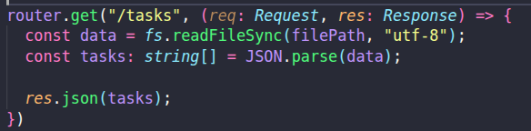
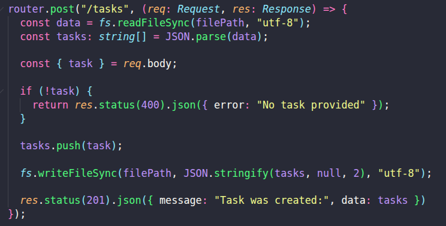
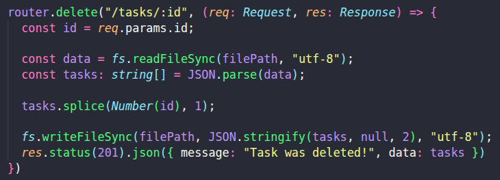
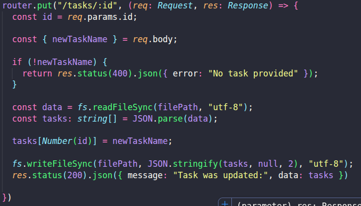

# Das ist meine erste Stage von meinem Thema "Versionierung"

## V1

Unter v1 sind alle Arten von CRUD zugänglich. Dabei besteht die einzelen Task nur aus einem einfachen String. Deleted oder edited wird anhand des index der task im array absolviert. 

### Get Tasks

Mit diesem Endpunkt können alle gespeicherten Tasks abgerufen werden. Es wird eine Liste aller Tasks im JSON-Format zurückgegeben.

**Pfad:** `GET /tasks`

---

### Create Task

Mit diesem Endpunkt kann ein neuer Task erstellt werden. Der Task wird im Body der Anfrage übergeben und zur bestehenden Liste hinzugefügt.

**Pfad:** `POST /tasks`

---

### Delete Task

Mit diesem Endpunkt kann ein Task anhand seiner ID gelöscht werden. Die ID wird als Parameter in der URL übergeben.

**Pfad:** `DELETE /tasks/:id`

---

### Edit Task

Mit diesem Endpunkt kann ein bestehender Task bearbeitet werden. Die ID des Tasks wird als URL-Parameter übergeben, der neue Name im Body.

**Pfad:** `PUT /tasks/:id`

### Zusammenfassung

Ich habe das extra mit den strings (einzelner task) damit ich zeige, wie wichtig versionierung ist. 

Viele denken: „Warum den alten Code behalten? Ich verbessere ihn einfach zu v2 und fertig!“ Doch in der Softwareentwicklung bei erweiterten Systemen ist das ein riesen Fehler. Hier ist der Grund:

Vermeidung von „Breaking Changes“:
In v1 nutzen wir einfache Strings. Wenn wir die API einfach auf Objekte (v2) umstellen würden, ohne die alte Version beizubehalten, würde jede App und jede Website, die noch das alte Format erwartet, sofort abstürzen. Das nennt man einen Breaking Change.

Rückwärtskompatibilität (Backward Compatibility):
Durch die Versionierung erlauben wir es dem System, zu wachsen, ohne die Vergangenheit zu zerstören. v1 bleibt für die „Legacy“-Nutzer (die alte Garde) stabil erreichbar, während v2 die neuen, modernen Features wie Checkboxen und IDs einführt.

Das heißt wenn ein "Max" die app nutzt für eine lange zeit, und nicht merkt, dass ein update rauskam, dann würde Max immer noch tasks als string zum backend senden, obwohl das backend nun erweiterte Formate erwartet. Mit v1 sagen wir aber, dass Max immer noch solche Tasks senden darf, mit v2 sagen wir, dass nutzer, die bereits das update installiert haben, die neuen features nutzen dürfen. Beide zufriedengestellt! Warum wichtig? In der software Welt verliert man sehr schnell Kunden. Wenn Max also Issues hat mit der App wechselt er direkt zu einem Konkurrenten!