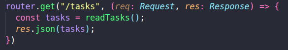
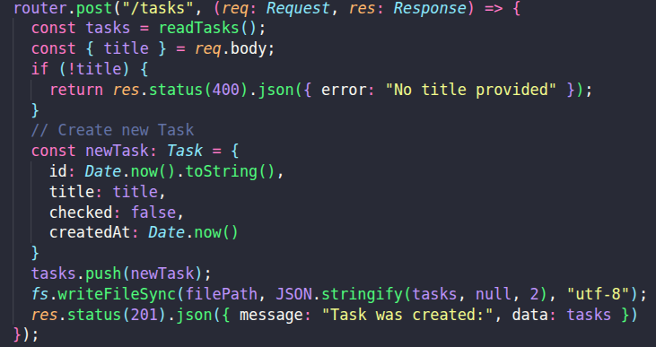
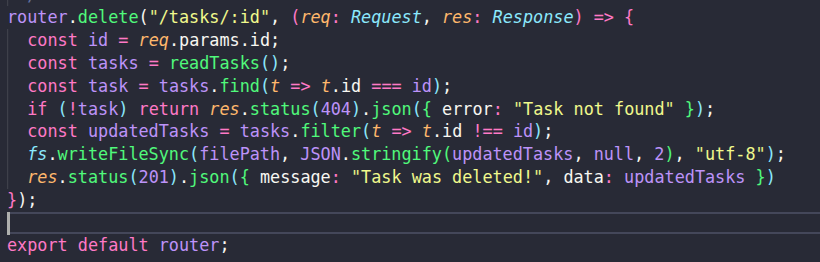
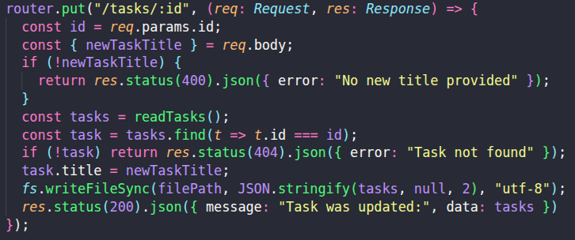
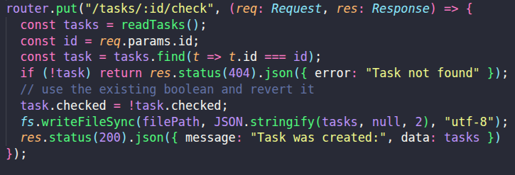

# Das ist meine zweite Stage von meinem Thema "Versionierung"

## V2

Unter v2 sind alle Arten von CRUD zugänglich, aber die Task-Struktur ist deutlich erweitert. Jeder Task ist jetzt ein Objekt mit eindeutiger ID, Titel, Status (checked) und Erstellungsdatum. Das Deleten, Bearbeiten und Überprüfen erfolgt über die ID (Date.now() als string) des Tasks.

### Get Tasks

Mit diesem Endpunkt können alle gespeicherten Tasks abgerufen werden. Es wird eine Liste aller Task-Objekte im JSON-Format zurückgegeben.

**Pfad:** `GET /tasks`

---

### Create Task

Mit diesem Endpunkt kann ein neuer Task erstellt werden. Im Body der Anfrage wird ein Titel übergeben. Der Task erhält automatisch eine ID, einen Status (checked: false) und ein Erstellungsdatum.

**Pfad:** `POST /tasks`

---

### Delete Task

Mit diesem Endpunkt kann ein Task anhand seiner ID gelöscht werden. Die ID wird als Parameter in der URL übergeben.

**Pfad:** `DELETE /tasks/:id`

---

### Edit Task

Mit diesem Endpunkt kann der Titel eines bestehenden Tasks bearbeitet werden. Die ID des Tasks wird als URL-Parameter übergeben, der neue Titel im Body.

**Pfad:** `PUT /tasks/:id`

---

### Check/Uncheck Task

Mit diesem Endpunkt kann der Status eines Tasks (abgehakt oder nicht) geändert werden. Die ID des Tasks wird als URL-Parameter übergeben. Der Status wird invertiert (true/false).

**Pfad:** `PUT /tasks/:id/check`

---

### Zusammenfassung

In v2 wurde die Task-Struktur erweitert, um mehr Funktionalität zu bieten (z.B. Checkbox, Zeitstempel, eindeutige Task Instanz). Das zeigt, wie APIs mit der Zeit wachsen und neue Features einführen können, ohne alte Nutzer zu verlieren. Durch Versionierung bleibt v1 für alte Clients erhalten, während v2 moderne Features bereitstellt. So können alle Nutzergruppen parallel und ohne Unterbrechung weiterarbeiten.
